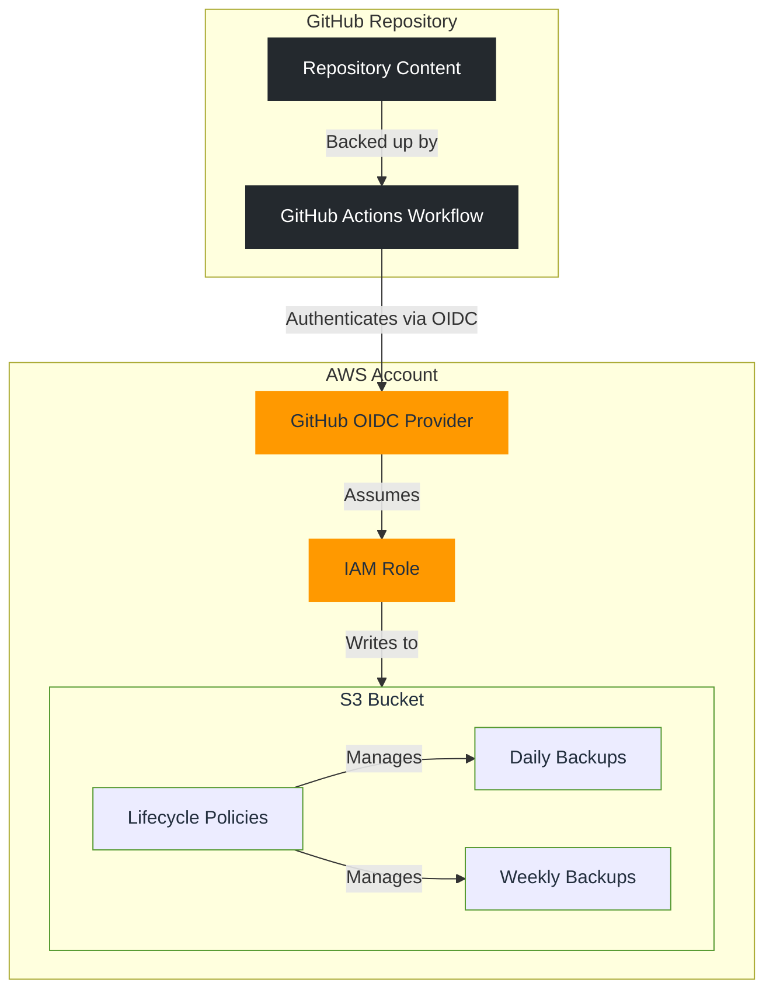

# 🫰 GitSnap

**GitSnap** is an automated GitOps solution for reliable GitHub repository backups to AWS S3 with intelligent lifecycle management.

## 🔍 Overview

GitSnap creates a secure, automated backup system for your GitHub repositories with the following features:

- **Zero-touch operation**: Set it and forget it - daily and weekly backups run automatically
- **Secure authentication**: Uses GitHub OIDC for keyless authentication to AWS
- **Intelligent storage lifecycle**: Configurable retention policies for daily and weekly backups
- **Cost-optimized storage**: Leverages AWS S3 storage classes for cost-effective long-term storage
- **Non-destructive design**: Prevents accidental deletion of backup data

## 🏗️ Architecture

## 🚀 Getting Started

### Prerequisites

- AWS Account designated for backups
- GitHub repository you want to back up

### Deployment Steps

#### 1️⃣ Create a dedicated AWS account for backups

For optimal security, create a dedicated AWS account for your backups:

1. Log in to your AWS Organizations console
2. Create a new account named "Backups" or similar
3. Configure appropriate access for administrators

#### 2️⃣ Deploy the GitSnap CloudFormation stack

Deploy the CloudFormation stack in your AWS Account - via the UI is fine.

#### 3️⃣ Add the GitHub Actions workflow to your repository

The CloudFormation stack will write a github-workflow.yaml to the S3 bucket.  

Download this, and upload as-is to your `./github/workflows` directiry in your repository 

#### 4️⃣ Run your first backup

1. Go to your repository on GitHub
2. Navigate to "Actions" tab
3. Select the "GitSnap - Regular Scheduled Backup" workflow
4. Click "Run workflow" and confirm the manual run
5. Monitor the execution to ensure it completes successfully

## 🧩 What Gets Created

When you deploy the GitSnap CloudFormation stack, the following resources are provisioned:

| Resource | Description |
|----------|-------------|
| GitHub OIDC Provider | Enables secure, keyless authentication from GitHub Actions |
| IAM Role | Provides limited permissions for GitHub Actions to write to your S3 bucket |
| S3 Bucket | Storage for your repository backups with versioning enabled |
| Lifecycle Policies | Automatically manages backup retention based on your configuration |

## ⚙️ Customization Options

The CloudFormation template accepts the following parameters:

| Parameter | Description | Default |
|-----------|-------------|---------|
| GitHubRepositoryName | Name of the GitHub repository to back up (owner/repo) | Required |
| DailyBackupRetentionDays | Number of days to retain daily backups | 30 |
| WeeklyBackupRetentionDays | Number of days to retain weekly backups | 365 |
| S3StorageClass | Storage class for backups | GLACIER_IR |

Available storage classes:

- `STANDARD` - Frequently accessed data
- `INTELLIGENT_TIERING` - Data with unknown or changing access patterns
- `STANDARD_IA` - Long-lived, infrequently accessed data
- `ONEZONE_IA` - Long-lived, infrequently accessed, non-critical data
- `GLACIER` - Long-term archive with retrieval times in minutes to hours
- `GLACIER_IR` - Long-term archive with immediate retrieval
- `DEEP_ARCHIVE` - Long-term archive with retrieval times within 12 hours

## 🔒 Security Features

GitSnap implements several security best practices:

- **GitHub OIDC Integration**: No long-term AWS credentials stored in GitHub
- **Principle of Least Privilege**: IAM roles with minimal required permissions
- **S3 Bucket Protection**: 
  - Versioning enabled to protect against accidental overwrites
  - Public access blocked
  - Deletion protection via bucket policies
- **Identity-based Authentication**: Actions are tied to specific GitHub repositories

## 📜 License

[MIT](LICENSE)

